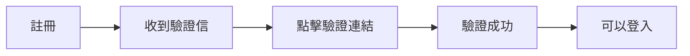
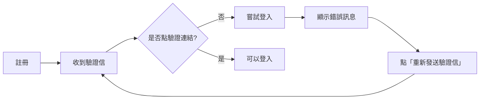

# Email 驗證功能指南

## ✅ 已完成的功能

### 1. 註冊流程（`app/register/page.tsx`）
- ✅ 使用 `supabase.auth.signUp()` 發送驗證信
- ✅ 顯示「註冊成功」畫面，提示用戶查收信箱
- ✅ **新增「重新發送驗證信」按鈕**
- ✅ 顯示重發成功訊息

### 2. 登入流程（`app/login/page.tsx`）
- ✅ 優化錯誤訊息顯示：
  - `Email not confirmed` → 「請先驗證您的 Email...」
  - `Invalid login credentials` → 「Email 或密碼錯誤」
  - `Email link is invalid or has expired` → 「驗證連結已過期...」

### 3. 驗證回呼（`app/auth/callback/route.ts`）
- ✅ 處理 OAuth 驗證回呼
- ✅ 驗證成功後導向 `/auth/redirect`

### 4. 檢查腳本（`scripts/check-email-verification.ts`）
- ✅ 查詢最近 10 位用戶的驗證狀態
- ✅ 統計驗證率
- ✅ 列出未驗證用戶（若有）

---

## 🔍 檢查 Email 驗證是否強制啟用

### 方法 1：執行檢查腳本

```bash
npx tsx scripts/check-email-verification.ts
```

**輸出範例**：
```
📊 最近註冊的用戶：
┌─────────┬─────────────────────────┬────────┬──────────────────────────┐
│ (index) │ Email                   │ 已驗證 │ 註冊時間                 │
├─────────┼─────────────────────────┼────────┼──────────────────────────┤
│ 0       │ 'test@example.com'      │ '✅'   │ '2026/2/13 下午11:30:00' │
└─────────┴─────────────────────────┴────────┴──────────────────────────┘

📈 驗證率：1/1 (100.0%)
✅ 所有用戶都已驗證 Email
```

### 方法 2：手動測試

1. **註冊測試帳號**：
   ```
   前往 https://www.plushub.cc/register
   輸入測試 Email（如 test@temp-mail.io）
   ```

2. **嘗試登入（不點驗證連結）**：
   ```
   前往 https://www.plushub.cc/login
   用剛註冊的帳號登入
   ```

3. **結果判斷**：
   - ✅ **顯示錯誤「請先驗證您的 Email」** → Email 驗證已啟用
   - ❌ **直接登入成功** → Email 驗證未啟用（需修正）

---

## 🔧 如何啟用強制驗證

### 在 Supabase Dashboard 設定

1. 前往 [Supabase Dashboard](https://supabase.com/dashboard/project/kashgsxlrdyuirijocld/auth/email-templates)

2. 點擊左側 **Authentication** → **Settings**

3. 找到 **Email Auth** 區塊

4. **啟用以下選項**：
   ```
   ☑️ Enable email confirmations
   ```

5. 點擊 **Save** 儲存

### 設定效果

| 設定 | 未啟用 | 已啟用 |
|------|--------|--------|
| 註冊後立即登入 | ✅ 可以 | ❌ 被阻擋 |
| 驗證信發送 | ✅ 發送 | ✅ 發送 |
| 登入提示 | 無 | 「Email not confirmed」 |
| 驗證後才能用 | ❌ | ✅ |

---

## 🎯 用戶體驗流程

### 正常流程



### 未驗證流程



---

## 📧 Email 模板

Supabase 預設的驗證信模板：

```html
<h2>確認您的註冊</h2>
<p>請點擊以下連結完成註冊：</p>
<a href="{{ .ConfirmationURL }}">確認 Email</a>
```

### 自訂模板位置

前往 **Authentication** → **Email Templates** → **Confirm signup**

建議修改為更友善的內容：

```html
<h2>歡迎加入 PlusHub！</h2>
<p>感謝您註冊 PlusHub 接單系統。</p>
<p>請點擊以下按鈕驗證您的 Email：</p>
<a href="{{ .ConfirmationURL }}" style="display:inline-block;padding:12px 24px;background:#ff6b35;color:white;text-decoration:none;border-radius:8px;">
  驗證 Email
</a>
<p>如果按鈕無法點擊，請複製以下連結至瀏覽器：</p>
<p>{{ .ConfirmationURL }}</p>
<p>此連結將在 24 小時後失效。</p>
```

---

## 🐛 常見問題

### 1. 用戶沒收到驗證信

**可能原因**：
- Email 進入垃圾郵件夾
- Email 地址輸入錯誤
- Supabase SMTP 設定問題

**解決方式**：
1. 請用戶檢查垃圾郵件
2. 點擊「重新發送驗證信」按鈕
3. 若持續失敗，檢查 Supabase Dashboard 的 SMTP 設定

### 2. 驗證連結點擊後顯示錯誤

**可能原因**：
- 連結已過期（預設 24 小時）
- 連結已被使用過
- 瀏覽器 Cookie 被阻擋

**解決方式**：
1. 返回註冊頁面重新發送驗證信
2. 確認瀏覽器允許 Cookie
3. 使用無痕模式測試

### 3. 驗證後還是無法登入

**檢查項目**：
1. 確認 `email_confirmed_at` 欄位已有時間戳記（用檢查腳本）
2. 清除瀏覽器快取和 Cookie
3. 確認使用正確的 Email 和密碼
4. 查看 Supabase Dashboard 的 Auth Logs

---

## 📊 監控驗證率

定期執行檢查腳本，確保驗證率維持在高水平：

```bash
# 每週執行一次
npx tsx scripts/check-email-verification.ts
```

**健康指標**：
- ✅ 驗證率 > 80%：健康
- ⚠️ 驗證率 60-80%：需注意（可能有 UX 問題）
- ❌ 驗證率 < 60%：有問題（檢查驗證流程）

---

## 🔒 安全性建議

1. ✅ 啟用「Enable email confirmations」（必須）
2. ✅ 設定驗證連結有效期（建議 24 小時）
3. ✅ 限制重發驗證信頻率（Supabase 內建 Rate Limiting）
4. ⚠️ 考慮新增 reCAPTCHA（防機器人註冊）
5. ⚠️ 定期清理未驗證超過 30 天的帳號

---

## 📝 下一步優化

- [ ] 新增驗證狀態顯示（Dashboard 顯示「待驗證」badge）
- [ ] Email 驗證提醒（登入後顯示「請驗證 Email」橫幅）
- [ ] 自動清理未驗證帳號（Supabase Edge Function + Cron）
- [ ] 驗證數據追蹤（Google Analytics 事件）
